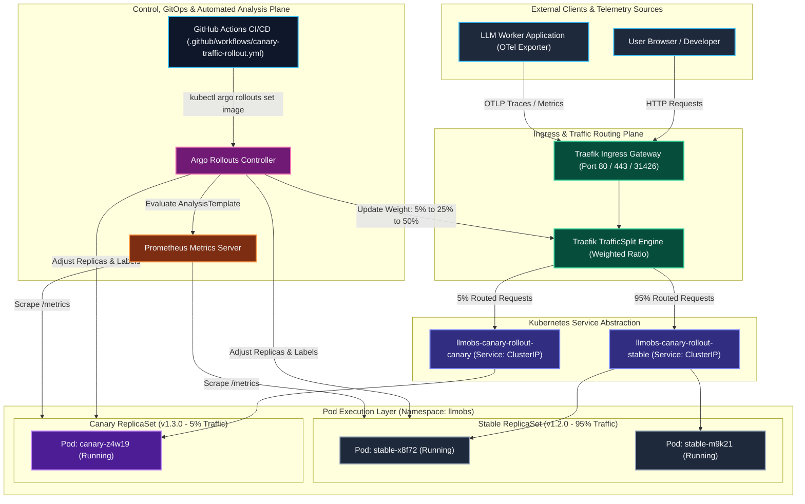

  

  

---

## 🌐 Enterprise Architectural Overview

**Scaibu** is an advanced software engineering and research laboratory specializing in the design and implementation of high-throughput distributed systems, autonomous agentic AI architectures, and high-dimensional semantic search engines.

<table>
  <tr>
    <td width="60%" valign="top">
      <h3>🏛️ Core Architectural Principles</h3>
      <ul>
        <li><strong>⚡ Sub-Millisecond Event Streaming:</strong> High-concurrency event brokers and asynchronous streaming architectures designed for zero-data-loss execution.</li>
        <li><strong>🤖 Autonomous Multi-Agent Systems:</strong> Graph-based state machines and A2A communication protocols enabling multi-agent orchestration.</li>
        <li><strong>📐 Dense Semantic Retrieval:</strong> Production-grade RAG and hybrid vector retrieval engines powered by Pinecone, Qdrant, and pgvector.</li>
        <li><strong>☁️ Declarative Infrastructure:</strong> Immutable infrastructure as code (IaC) utilizing Terraform, Kubernetes, and automated CI/CD pipelines.</li>
      </ul>
    </td>
    <td width="40%" align="center" valign="middle">
      
    </td>
  </tr>
</table>

---

## 📊 SRE Performance Benchmarks & SLO Matrix

| Metric / Dimension | Target / Benchmark | Architectural Implementation |
|---|---|---|
| **🚀 Peak Ingestion & Scale** | **1,000,000+ Requests in 3 mins** | Asynchronous non-blocking I/O event loops, connection pooling, and multi-threaded stream workers. |
| **⏱️ Latency Budget (p99)** | **< 15ms** | In-memory Redis caching layers, zero-copy serialization, and kernel-level socket optimizations. |
| **🛡️ Reliability & SLO** | **99.99% High Availability** | 4-stage progressive canary deployment (`5% → 25% → 50% → 100%`) with automatic sub-5s rollbacks. |
| **🔄 Event Streaming Flow** | **50k+ msgs / sec** | Partition-aware Apache Kafka pipelines with idempotent consumer offsets and zero-data-loss guarantees. |
| **📐 Vector Search Retrieval** | **< 20ms p95** | Hierarchical semantic chunking with HNSW indexed vector spaces across Pinecone, Qdrant & pgvector. |
| **📦 Modular Reusability** | **90+ Composable Packages** | Schema-driven anti-corruption adapters and generic data engines for instant plug-and-play reuse. |

---

## 🛠️ Technology & Architecture Stack

### 🧠 Machine Learning & Agentic AI

### 📐 Vector Databases & Semantic Search

### ☁️ Cloud, DevOps & Infrastructure as Code (IaC)

### ⚡ Distributed Systems & Backend Frameworks

---

## 🏛️ Featured Open Source & Flagship Platforms

| Repository | Domain | Architectural Focus |
|---|---|---|
| 🛒 [ProcureIQ](https://github.com/Scaibu/ProcureIQ) | Enterprise AI | Intelligent autonomous procurement platform with multi-modal LLM reasoning |
| 📊 [llm-observability-platform](https://github.com/Scaibu/llm-observability-platform) | AI Observability | OpenTelemetry tracing, latency tracking, and token cost telemetry for agent runs |
| 🔄 [kafka-messaging-pipeline](https://github.com/Scaibu/kafka-messaging-pipeline) | Distributed Systems | High-throughput distributed event streaming pipeline with idempotency guarantees |
| 🌐 [a2a-demo](https://github.com/Scaibu/a2a-demo) | Agent Communication | Multi-agent protocol demonstration utilizing LangGraph and Google Gemini |
| 🔒 [scaibu_mutex_lock](https://github.com/Scaibu/scaibu_mutex_lock) | Concurrency | High-performance asynchronous mutex lock implementation for concurrent runtimes |

---

## 📚 Technical Research & Publications

> Our engineering team actively publishes deep-dive architectural analyses on distributed system resilience, consensus, and AI systems — **300+ articles published on Medium.**

* 📖 **[Why Replication Is One of the Hardest Problems in Distributed Systems](https://medium.com/codetodeploy/why-replication-is-one-of-the-hardest-problems-in-distributed-systems-960de0117657)**
* 📖 **[The Physics of Payment Systems: Why Exactly-Once Semantics Fail in Practice](https://medium.com/h7w/the-physics-of-payment-systems-why-exactly-once-semantics-fail-in-practice-895b5616baa0)**
* 📖 **[From Minutes to Milliseconds: Docker Build Optimization](https://medium.com/h7w/from-minutes-to-milliseconds-docker-build-optimization-0bbc706ec692)**
* 📖 **[Hierarchical Semantic Chunking in RAG Architectures](https://medium.com/h7w/hierarchical-semantic-chunking-129bb46bba92)**
* 📖 **[Retry, Error Handling & Idempotency: The Hidden Science of Reliable Systems](https://medium.com/@scaibu)**

---

## 🤝 Partner & Collaborate With Scaibu

We collaborate with forward-thinking enterprises, engineering leaders, and scale-ups to design and deploy fault-tolerant distributed platforms and mission-critical AI systems.

---

## 🏛️ Reference Progressive Delivery & Canary Architecture (ADR-0017)

> *High-Level Design (HLD) showing external client ingress, Traefik traffic splitting, Argo Rollouts controller, dual-ReplicaSet topology, and automated Prometheus analysis.*

---

  © Scaibu. Architecting the future of intelligent systems.

